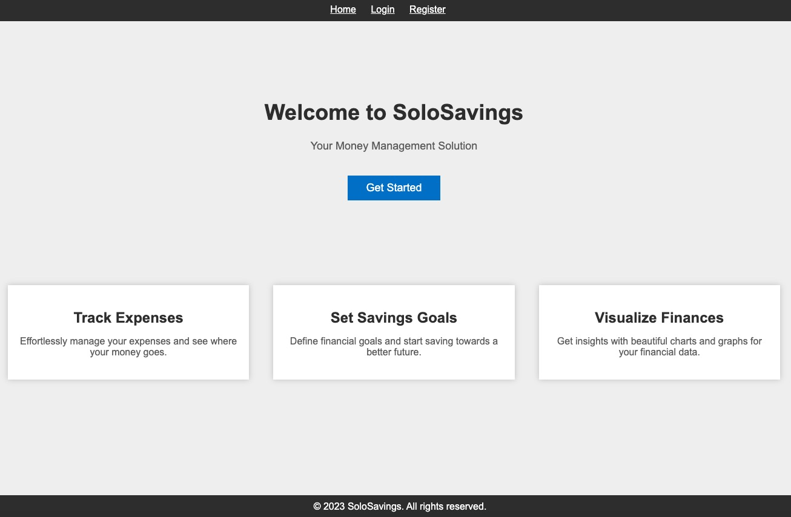
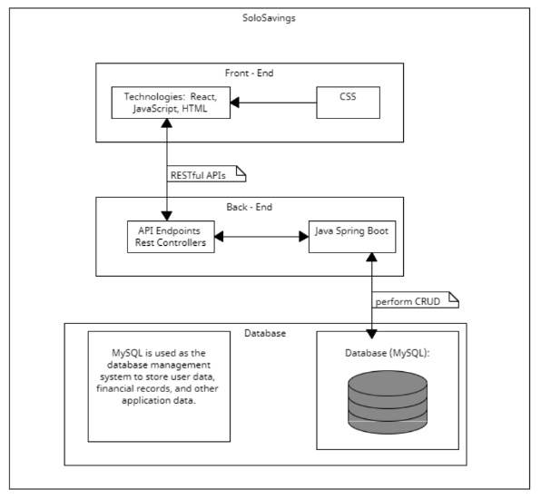
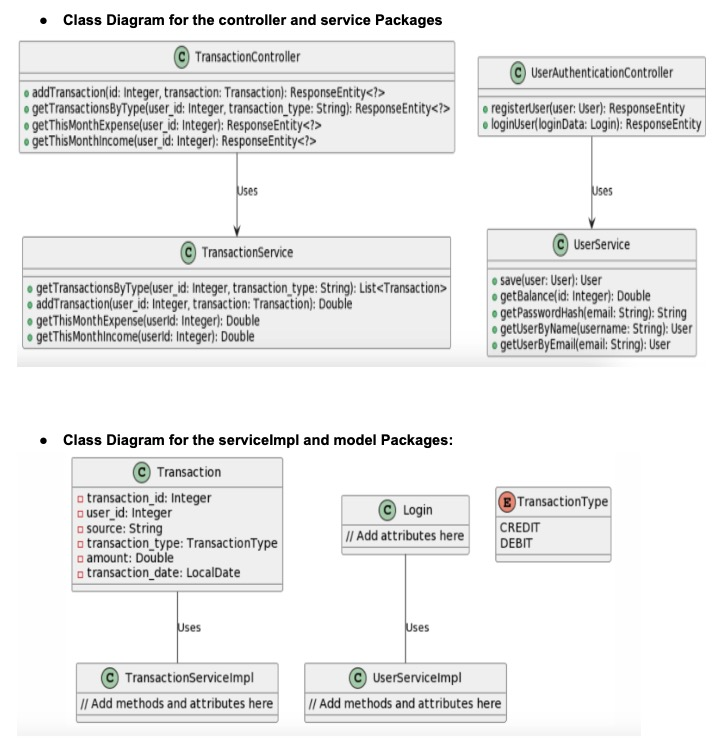
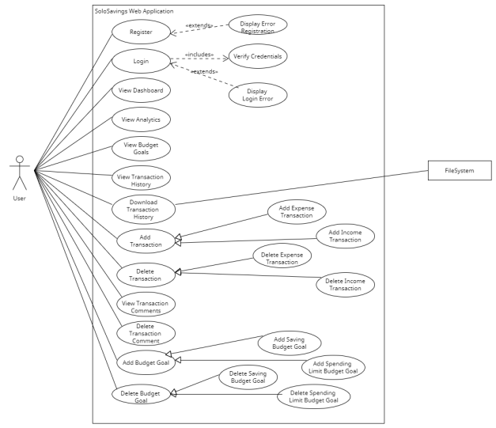
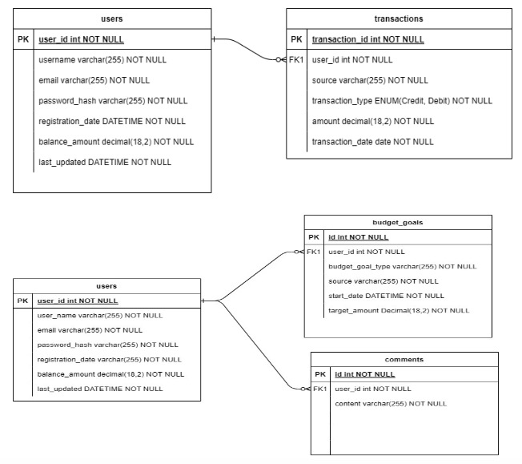
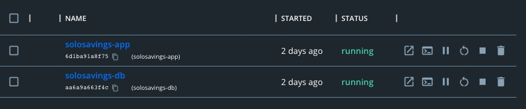

# Table of Contents
- [SoloSavings](#SoloSavings)
- [Achitecture](#Achitecture)
- [Design Patterns](#Design-Patterns)
- [Use Case Diagram](#Use-Case-Diagram)
- [Database Design](#Database-Design)
- [Deployment](#Deployment)
- [Development](#Development)

# SoloSavings 


"SoloSavings" is a Personal Budgeting Financial Application designed to help individuals manage their finances more effectively. It provides tools and features to assist users in creating and maintaining a budget, tracking their expenses, and achieving their financial goals. With SoloSavings, users can gain better control over their personal finances and make informed decisions to save, invest, and plan for the future.

### https://solosavings.wanl.blue 


[[↑] Back to top](#table-of-contents)

## Architecture


The SoloSavings web application is designed with a layered architecture that separates concerns and promotes modularity and maintainability. It consists of the following key components:

1. Frontend (UI):
The frontend is responsible for the user interface and user experience.\
Technologies:JSP, JavaScript, HTML, CSS.\
The frontend communicates with the backend through RESTful APIs.

2. Backend (Java Spring Boot):
The backend handles business logic, data processing, and interacts with the database.\
Technologies: Java Spring Boot, Spring Security for authentication and authorization.\
It exposes RESTful APIs to the frontend for data retrieval and manipulation.

3. Database (MySQL):
MySQL is used as the database management system to store user data, financial records, and other application data.\
The backend interacts with the MySQL database to perform CRUD (Create, Read, Update, Delete) operations.

4. Frontend-Backend Communication:
The frontend communicates with the backend through RESTful APIs.\
REST endpoints are defined in the backend to handle HTTP requests from the frontend.

5. Dependency and Interaction:
The frontend interacts with the backend through API calls, making HTTP requests to fetch and update data.\
Spring Boot acts as the middleware between the frontend and the database, processing requests and managing data retrieval and storage.\
MySQL stores user data, financial records, and application data.

6. Framework:
Java Spring Boot is used as the primary backend framework, providing features for handling RESTful APIs, security, and database interactions.\
Java Security is used as the primary security framework, providing security features for authentication.

[[↑] Back to top](#table-of-contents)

## Design Patterns
### MVC-R (Model-View-Controller with Repository)
#### Intent:
The MVC-R design pattern, an extension of the classic Model-View-Controller (MVC) pattern, introduces a Repository layer to decouple data access from user interface and business logic in the SoloSavings application. The primary aim is to establish a well-structured, maintainable, and scalable architectural foundation.

#### Motivation:
The SoloSavings application requires an architectural pattern that distinguishes data access concerns from user interfaces and business logic. The MVC-R pattern addresses this by incorporating a Repository layer.

[[↑] Back to top](#table-of-contents)

## Class Diagram


[[↑] Back to top](#table-of-contents)

## Use Case Diagram


[[↑] Back to top](#table-of-contents)

## Database Design
This database design serves as a foundation for the "SoloSavings" application, facilitating the management of user accounts and transactions(income, expenses) to manage the user balance.



#### Entities:

1. Users table:

###### Attributes:
- user_id (Primary Key): Unique identifier for each user.
- username: User's chosen username.
- password_hash (or encrypted password): Securely stored password hash.
- email: User's email address.
- registration_date: Date and time of user registration.
- Balance_amount: user’s ongoing balance based on transactions
- Last_updated: date and time user record updated


2. Transaction table:

###### Attributes:
- transaction_id (Primary Key): Unique identifier for each transaction record.
- user_id (Foreign Key referencing Users): Identifies the user associated with the income.
- source: Source of transaction (e.g., salary, freelance work, electricity bill, cellphone bill).
- Transaction_type: CREDIT for Income/DEBIT for expenses
- amount: Amount of transaction.
- transaction_date: Date of the transaction.

3. BudgetGoal table:

###### Attributes:
- id (Primary Key): Unique identifier for each budget goal record
- user_id (Foreign Key referencing Users): Identifies the user associated with the income
- budget_goal_type: SAVE for saving goals SPEND for spending goals
- source: Source budget goal is in reference to (e.g. Work, Utils, Fun)
- start_date: Date of budget goal
- target_amount: Amount budgeted for goal

4. Comments table:

###### Attributes:
- id (Primary Key): Unique identifier for each budget goal record
- user_id (Foreign Key referencing Users): Identifies the user associated with the income
- content: Comments for each transaction id

#### Relationships:

Users can have multiple transaction records, and each transaction record belongs to a user. This is a one-to-many relationship. Users can also have multiple budget goal records and each budget goal record belongs to a user. This is also a one-to-many relationship. Users can have multiple comments records (One-to-Many)

#### Explanation:

The "Users" table stores user account information, including login credentials and current balance.

The "transaction" table stores income-related transactions and expense-related transactions, including the source of transaction, amount, and date. It is related to the "Users" table through the user_id foreign key.

The “BudgetGoal” table stores the budget goal a user would like to meet. Data includes the type of goal, source it’ll be in reference to and target amount they would like to set. It is related to the “Users” table through the user_id foreign key.
Comments table stores content for future reference on the users account.

[[↑] Back to top](#table-of-contents)

## Development


#### MAC
1. To run application in Docker first open Docker on your computer.
2. Then navigate to `\code\database` and run the following `./setup-docker.sh --build` then `./setup-docker.sh -s`
3. Then navigate to `\code\SoloSavingsApp` and run the following `./setup-docker.sh --build` then `./setup-docker.sh -s`
4. Then enter the following in your browser `http://localhost:8888/solosavings`

#### PC
1. To run application in Docker first open Docker on your computer.
2. Then navigate to `\code\database` and run the following `Setup-Docker.ps1 -build` then `Setup-Docker.ps1 -start`
3. Then navigate to `\code\SoloSavingsApp` and run the following `Setup-Docker.ps1 -build` then `Setup-Docker.ps1 -start`
4. Then enter the following in your browser `http://localhost:8888/solosavings`

#### API Endpoints
```java
/api/user
/api/register
/api/login
/api/forget-password
/api/reset-password
/api/transaction/add
/api/transaction/credit
/api/transaction/debit
/api/transaction/monthly/income
/api/transaction/monthly/expense
/api/transaction/delete/{transaction_id}
/api/transaction/{transaction_type}
/api/transaction/thismonth/{transactionType}
/api/transaction/export/csv
/api/transaction/analytics/monthly/{type}/{year}
/api/transaction/history
/api/budgetgoal/add
/api/budgetgoal/delete/{budgetgoal_id}
/api/budgetgoal/all
```

[[↑] Back to top](#table-of-contents)

## Deployment

### Docker configuration

We are leveraging docker to conatinerize both the web application and the backing MySQL database.

There is a dependency for a shared docker network between the two containers.

To create this please run:

```
docker network create solosavings-net
```

Within each sub-directory is a Setup-Docker script (.ps1 for Windows, .sh for UNIX-based).

This script has the following parameters:

```
- Build     : Generates the docker image 
  - solosavings-db for the database
  - solosavings-app for the appliaction
- Start     : Start the docker container
  - solosavings-db listens on TCP/9000 on the container host and 3306 for the database
  - solosavings-db listens on TCP/8888 on the container host and 8888 for the application
- Detached  : This parameter detaches the container from stdout
- Stop      : This parameter stops the docker container
```

For container discovery, the `application.properties` leverages the following for its database URL:

```
spring.datasource.url=jdbc:mysql://${SPRING_MYSQL_HOST:localhost}:3306/solosavings
```

If the SPRING_MYSQL_HOST environment variable is defined (which it is in the solosavings-app docker image) it will leverage solosavings-db as the hostname and resolve it through container DNS.

Otherwise, the value will default to localhost.

[[↑] Back to top](#table-of-contents)